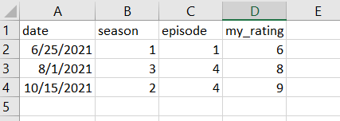
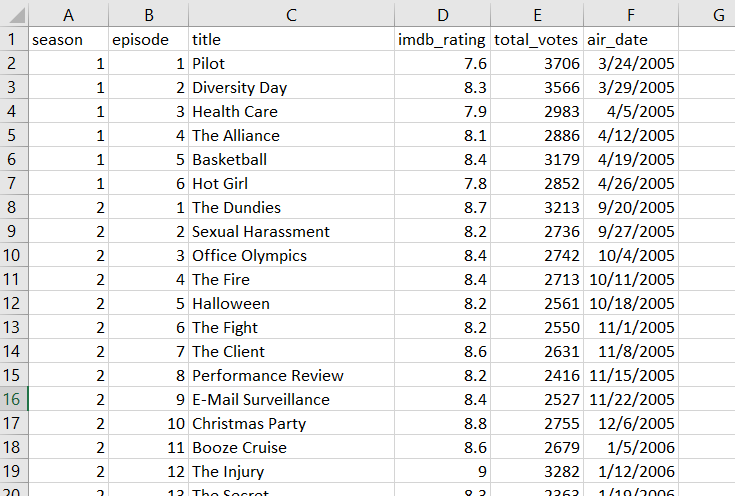
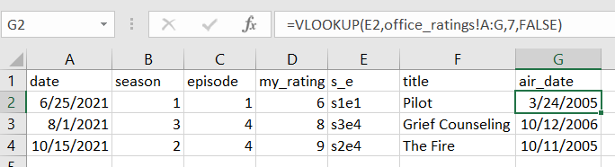

```{r, setup, eval = TRUE, include = FALSE}
library(tidyverse)
#knitr::opts_chunk$set(fig.width = 8, collapse = TRUE)
```

# What is VLOOKUP?

--

.pull-left[

]

--

.pull-right[

]

--

=VLOOKUP([value to look for], [table to look in], [column nr], [approx. match ok?])

--




---

# Let's do this in R

```{r, load_samples, eval = TRUE, echo = FALSE,  message=FALSE}
my_ratings <- tibble(
  date = c("2021-06-25", "2021-08-01", "2021-10-15"), 
  season = c(1, 3, 2),
  episode = c(1, 4, 4),
  my_rating = c(6,8,9)
)

office_ratings <- readr::read_csv('https://raw.githubusercontent.com/rfordatascience/tidytuesday/master/data/2020/2020-03-17/office_ratings.csv')

```

```{r, show_samples, eval = TRUE, echo = TRUE}
my_ratings

office_ratings
```

---

# There's a package for that!

```{r, install_tidyquant, eval= FALSE, echo = TRUE, message=FALSE, warning=FALSE}
install.packages("tidyquant")
```
--
```{r, add_id_col, eval= TRUE, echo = TRUE, message=FALSE, warning=FALSE}
my_ratings_with_s_e <- my_ratings %>% 
  mutate(s_e = paste("s", season, "e", episode, sep = "")) 

office_ratings_with_s_e <- office_ratings %>% 
  mutate(s_e = paste("s", season, "e", episode, sep = ""))
```
--
```{r, tidyquant_vlookup, eval= TRUE, echo = TRUE, message=FALSE, warning=FALSE}
my_ratings_with_more_info <- my_ratings_with_s_e %>% 
  mutate(
    title = tidyquant::VLOOKUP(s_e, office_ratings_with_s_e, s_e, title),
    air_date = tidyquant::VLOOKUP(s_e, office_ratings_with_s_e, s_e, air_date)
         )
```
--
```{r, tidyquant_result, eval= TRUE, echo = FALSE, message=FALSE, warning=FALSE}
my_ratings_with_more_info
```

---

# But what is a VLOOKUP, really?

--

.pull-left[
```{r, table_my_ratings, eval = TRUE, echo= FALSE, message=FALSE, warning=FALSE}
knitr::kable(my_ratings, format = "html")

```
]
--
.pull-right[
```{r, table_office_ratings, eval = TRUE, echo= FALSE, message=FALSE, warning=FALSE}
knitr::kable(head(select(office_ratings, -imdb_rating, -total_votes)), format = "html")
```
]

--

This is a join!

---

# VLOOKUP with the tidyverse: dplyr joins
--
```{r, with_join, eval = TRUE, echo=TRUE}
left_join(my_ratings, office_ratings)
```
--
```{r, with_join_select, eval = TRUE, echo=TRUE}
left_join(my_ratings, office_ratings) %>% select(-imdb_rating, -total_votes)
```

---

# Why use joins?

- You can join by multiple columns
  - In this example: No need to create a "s1e1" column to use as an id

--


- You can add multiple columns at once
  - In this example: no need for repetitious code in the mutate code

--


- You can use different join functions to suit the specific needs of your use case

---

# Obstacle: What if the data is messier?

```{r, load_schrute, eval=TRUE, include=FALSE}
schrute_data <- schrute::theoffice
```
```{r, show_schrute, eval=TRUE, echo=TRUE, results='hide'}
schrute_data
```
```{r, print_schrute, eval=TRUE, echo=FALSE}
print(as_tibble(schrute_data), n = 5)
```
--
```{r, join_shrute, eval=TRUE, echo=TRUE, results='hide', message=FALSE}
left_join(my_ratings, schrute_data)
```
```{r, print_join_shrute, eval=TRUE, echo=FALSE}
print(as_tibble(left_join(my_ratings, schrute_data)), n = 5)
```

---

# Solution: Create the tibble you'll need

```{r, solution, eval=TRUE, echo=TRUE}
schrute_data_for_join <- schrute_data %>%
  select(season, episode, title = episode_name, air_date) %>% 
  distinct()

left_join(my_ratings, schrute_data_for_join)
```

---

# Conclusion: How to do VLOOKUP in R

- If you need to replicate VLOOKUP as close to the excel version as possible, use
the `VLOOKUP()` function from the `tidyquant` package.

--

- Consider using dplyr joins instead.

--

- If the dataframe that has the information you want has more columns than you want to add or it has duplicates in your lookup column(s), create the tibble you'll need before doing the join.

--

<br><br>

.center[
  # Thank you!!
  Alejandra Gerosa - @alejagerosa - hello@alegerosa.com
]


